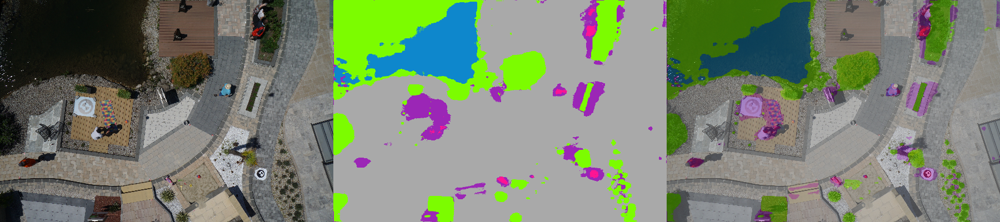
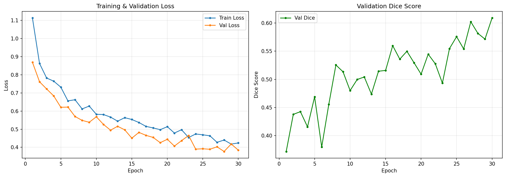
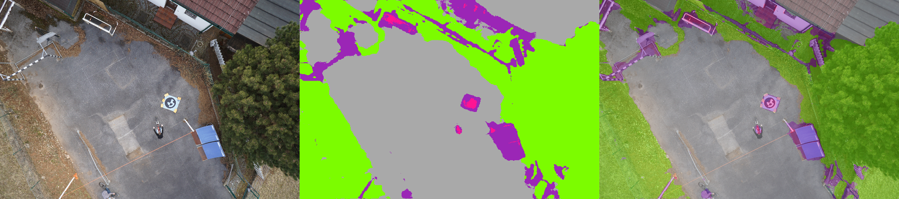
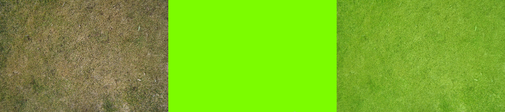
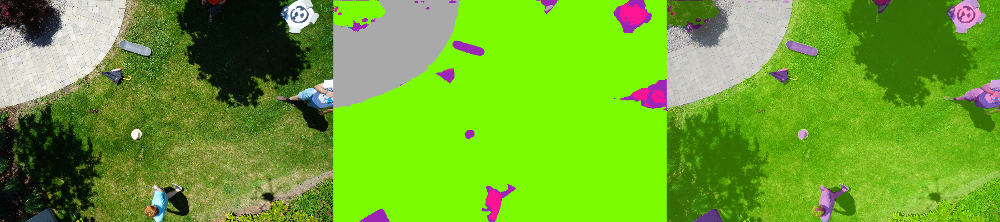
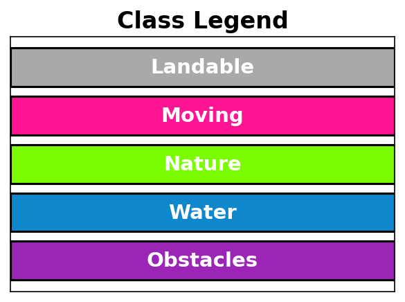

# 🚗 Autonomous Scene Segmentation with U-Net

A deep learning pipeline for **pixel-wise semantic segmentation** of aerial/road scenes using a custom **U-Net** architecture built from scratch in PyTorch. The model classifies every pixel in an image into one of 5 categories — enabling autonomous vehicles and drones to understand their surroundings for safe navigation, path planning, and obstacle avoidance.


*Left: Original Image | Center: Segmentation Mask | Right: Blended Overlay*

---

## 🎯 Problem Statement

Autonomous vehicles need to understand the scene around them in real-time — identifying roads, obstacles, pedestrians, vegetation, and water — to make safe driving and navigation decisions. This project performs **semantic segmentation** to classify every pixel in a scene, which is a core component of the perception stack in self-driving systems.

**Key Difference from Object Detection:**
- **Object Detection** draws bounding boxes around objects
- **Semantic Segmentation** classifies *every single pixel* — giving a much richer, denser understanding of the scene

---

## 📊 Results

### Training Performance

| Metric | Value |
|--------|-------|
| **Best Val Dice Score** | **0.6091** |
| Final Train Loss | 0.4242 |
| Final Val Loss | 0.3846 |
| Epochs | 30 |

### Training Curves



- **Loss** decreased steadily from 1.11 → 0.42 (train) and 0.87 → 0.38 (val)
- **Dice score** improved from 0.37 → 0.61 with consistent upward trend
- No overfitting — val loss tracks below train loss

---

## 📸 Sample Predictions

Each image shows: **Original** | **Segmentation Mask** | **Overlay**






**Class Legend:**



| Color | Class | Description |
|-------|-------|-------------|
| 🟣 Purple | **Obstacles** | Buildings, walls, fences, rocks — avoid these |
| 🔵 Blue | **Water** | Rivers, pools — hazardous zones |
| 🟢 Green | **Nature** | Grass, trees, vegetation — off-road terrain |
| 🩷 Pink | **Moving** | People, dogs, cars, bicycles — dynamic objects |
| ⬜ Gray | **Landable** | Paved roads, gravel, flat surfaces — safe to navigate |

---

## 📊 Dataset

**[Semantic Drone Dataset](https://www.kaggle.com/datasets/bulentsiyah/semantic-drone-dataset)** — 400 high-resolution aerial images (6000×4000 px) with pixel-level annotations across 24 fine-grained classes.

The original 24 classes are **grouped into 5 actionable categories** relevant for autonomous navigation:

```
24 fine-grained classes → 5 decision-making categories
  ├─ Obstacles (buildings, walls, fences, rocks, ...)
  ├─ Water     (rivers, pools)
  ├─ Nature    (grass, trees, vegetation)
  ├─ Moving    (people, cars, bicycles, animals)
  └─ Landable  (paved roads, gravel, flat roofs)
```

**Data Split:** 80% train (320 images) / 20% validation (80 images)

---

## 🧠 Model Architecture

Custom **U-Net** implementation built from scratch (~31M parameters):

```
Input (3×512×512)
  │
  ├─ Encoder (Downsampling Path)
  │   ├─ Stage 1: DoubleConv(3→64)   + MaxPool
  │   ├─ Stage 2: DoubleConv(64→128)  + MaxPool
  │   ├─ Stage 3: DoubleConv(128→256) + MaxPool
  │   └─ Stage 4: DoubleConv(256→512) + MaxPool
  │
  ├─ Bridge: DoubleConv(512→1024)
  │
  └─ Decoder (Upsampling Path + Skip Connections)
      ├─ Stage 4: ConvTranspose2d + Concat(skip) + DoubleConv(1024→512)
      ├─ Stage 3: ConvTranspose2d + Concat(skip) + DoubleConv(512→256)
      ├─ Stage 2: ConvTranspose2d + Concat(skip) + DoubleConv(256→128)
      └─ Stage 1: ConvTranspose2d + Concat(skip) + DoubleConv(128→64)
          │
          └─ Output: Conv1×1(64→5)

Output (5×512×512) — one channel per class
```

**DoubleConv** = Conv2d → BatchNorm → ReLU → Conv2d → BatchNorm → ReLU

**Skip Connections** concatenate encoder features with decoder features, preserving fine spatial details that would otherwise be lost during downsampling.

---

## 🏋️ Training Configuration

| Hyperparameter | Value |
|----------------|-------|
| Optimizer | Adam |
| Learning Rate | 1e-4 (with ReduceLROnPlateau) |
| Loss Function | CrossEntropyLoss |
| Batch Size | 8 |
| Epochs | 30 |
| Input Size | 512 × 512 |
| Metric | Dice Score (mean across classes) |

**Data Augmentation:** Random horizontal/vertical flips, 90° rotation, brightness/contrast adjustment, ImageNet normalization.

---

## 🚀 Quick Start

### 1. Install Dependencies

```bash
pip install -r requirements.txt
```

### 2. Download Dataset

Download the [Semantic Drone Dataset](https://www.kaggle.com/datasets/bulentsiyah/semantic-drone-dataset) and place it in `archive/`.

### 3. Train the Model

```bash
# Default settings (30 epochs)
python train.py

# Custom settings
python train.py --epochs 50 --batch_size 4 --lr 3e-4
```

Best model checkpoint is saved automatically when validation Dice score improves.

### 4. Run Inference

```bash
# On a directory of images
python infer.py --input test/ --output outputs/visual/

# On a single image with display
python infer.py --input path/to/image.png --output results/ --show
```


## 📁 Project Structure

```
drone-segmentation/
├── README.md                              # This file
├── config.py                              # Hyperparameters, paths, constants
├── model.py                               # U-Net architecture (single source)
├── dataset.py                             # Dataset class, transforms, loaders
├── utils.py                               # Metrics, visualization, logging
├── train.py                               # Training with checkpointing & scheduler
├── infer.py                               # Inference with argparse
├── requirements.txt                       # Python dependencies
├── .gitignore                             # Excludes weights & data from git
├── Drone_Segmentation_Training.ipynb      # Colab/Kaggle notebook
├── weights/
│   └── best_model.pth                     # Trained model (Dice: 0.6091)
├── results/
│   ├── training_curves.png                # Loss & Dice plots
│   ├── training_log.csv                   # Epoch-by-epoch metrics
│   ├── class_legend.png                   # Color legend for classes
│   ├── sample_predictions_grid.png        # All predictions in one grid
│   └── sample_predictions/                # Individual prediction images
└── archive/                               # Dataset (not in git)
```

---

## 🛠️ Tech Stack

| Tool | Purpose |
|------|---------|
| **PyTorch** | Model architecture & training loop |
| **Albumentations** | Fast image augmentation pipeline |
| **OpenCV** | Image I/O and processing |
| **scikit-learn** | Train/validation splitting |
| **Matplotlib** | Training curve visualization |

---

## 📝 Key Design Decisions

1. **Class grouping (24 → 5):** Fine-grained distinctions (window vs. door, fence vs. fence-pole) don't matter for navigation decisions. Grouping into actionable categories maps directly to what an autonomous system needs: *"Can I drive here? Is something moving? Is there water?"*

2. **U-Net from scratch:** Built the entire architecture manually instead of using a pretrained backbone to demonstrate deep understanding of encoder-decoder networks, skip connections, and transposed convolutions.

3. **Dice score metric:** Standard pixel accuracy is misleading when classes are imbalanced (e.g., "water" appears in very few images). Dice score measures per-class overlap, giving honest evaluation across all categories.

4. **ReduceLROnPlateau scheduler:** Automatically reduces learning rate when validation loss plateaus, allowing finer-grained optimization in later epochs.

---

## 🔮 Future Improvements

- [ ] Use a pretrained encoder backbone (ResNet-34/EfficientNet-B3) for better feature extraction
- [ ] Add per-class IoU and confusion matrix evaluation
- [ ] Export model to ONNX/TensorRT for real-time deployment
- [ ] Build a Gradio/Streamlit demo for interactive visualization
- [ ] Test on video sequences for temporal consistency
- [ ] Apply to front-facing dashcam datasets (CityScapes, BDD100K) for direct autonomous driving use

---

## 🔗 Relevance to Autonomous Driving

While trained on aerial drone images, the techniques used here are **directly applicable** to self-driving cars:

| This Project | Autonomous Driving Equivalent |
|---|---|
| U-Net semantic segmentation | Scene understanding (Tesla, Waymo use similar architectures) |
| 5-class grouping | Road/obstacle/pedestrian classification |
| Dice score evaluation | Standard segmentation metric in AV industry |
| Skip connections | Preserving fine details for precise boundaries |
| Data augmentation | Handling varied lighting/weather conditions |

Popular autonomous driving datasets like **CityScapes**, **BDD100K**, and **nuScenes** use the exact same semantic segmentation approach at their core.

---

## 📜 License

This project is for educational and portfolio purposes. Dataset from [Kaggle](https://www.kaggle.com/datasets/bulentsiyah/semantic-drone-dataset).
